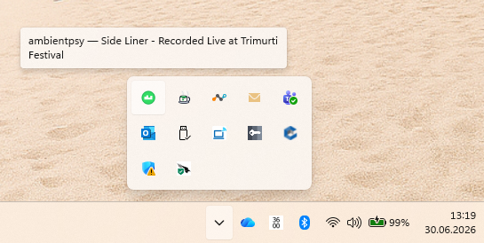
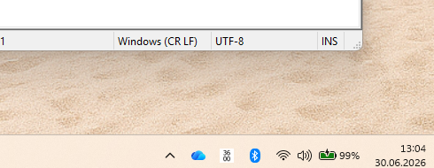
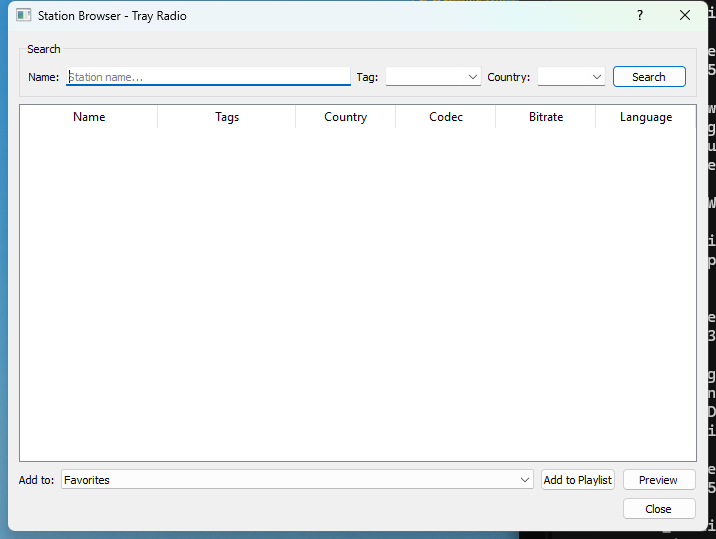
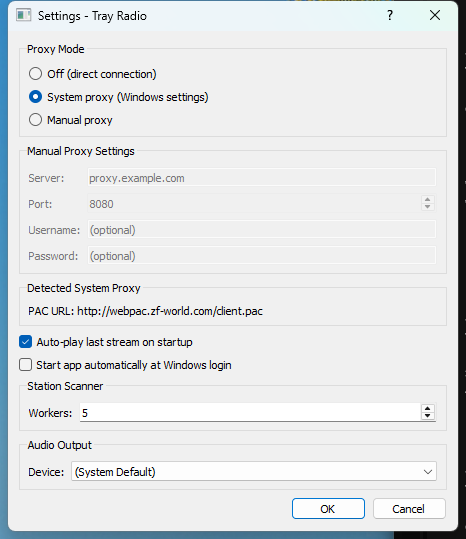

# Tray Radio

A Windows 11 system tray internet radio player. Plays MP3, AAC/AAC+, FLAC, OGG Vorbis, and WAV streams. Features a station browser, playlist management, global media keys, commercial detection, autostart, audio output device selection, and custom popup notifications.

## Screenshots

| Tray Icon | Now Playing Notification |
|---|---|
|  |  |

| Station Browser | Settings |
|---|---|
|  |  |

## Features

- **System tray operation** — runs silently in the notification area; right-click for menu
- **Station Browser** — search [radio-browser.info](https://radio-browser.info) and curated local stations with codec filtering, parallel stream checking, quick preview, and pagination ("Load more")
- **Commercial detection** — optional heuristic scan that checks redirect chains for ad domains and analyzes audio byte transitions for commercial-like patterns
- **Playlist management** — multiple named playlists, drag-to-reorder, duplicate prevention by UUID
- **Custom popup notifications** — frameless Qt toast popup (no Windows Action Center storage) with fade animation; song title or station name on connect
- **AAC/AAC+ support** — via PyAV decoding (no external codecs required)
- **FLAC container fallback** — PyAV `av.open()` handles OGG-encapsulated FLAC streams when miniaudio decoder fails
- **Output device selection** — choose your audio hardware (speakers, headphones, etc.)
- **Global media keys** — Play/Pause, Stop, Next, Previous via keyboard media buttons
- **Multi-catalog** — switch between radio-browser.info and a curated 160-station local catalog
- **Auto-start** — launch at Windows login via registry
- **Auto-play** — resume last stream on startup (playlist or preview)
- **Last stream persistence** — the last played stream is restored on restart, whether selected from a playlist or previewed from search results
- **Proxy support** — auto-detects system proxy via WinHTTP API; uses PAC if configured
- **Manual stream addition** — add custom streams by name and URL to any playlist
- **Station name cleaning** — strips leading junk characters (`+`, `-`, `#`, etc.) from station names
- **Single-file build** — self-contained `.exe`, no runtime dependencies

## Install

### MSI Installer (recommended)

Download `Tray Radio.msi` from the [Releases](https://github.com/Kalrkloss/tray_radio/releases) page. The installer:

- Installs to `Program Files\Tray Radio`
- Creates Start Menu and Desktop shortcuts
- Creates `%APPDATA%\tray_radio` for configuration
- Adds Add/Remove Programs entry
- Supports upgrades (old version auto-removed)

### Portable EXE

Download `Tray Radio.exe` from the [Releases](https://github.com/Kalrkloss/tray_radio/releases) page. Run it directly — no installation needed. Configuration is stored in `%APPDATA%\tray_radio\`.

## How to Use

### First Launch

Run `Tray Radio.exe`. An icon appears in the system tray (near the clock). Right-click the icon to open the menu.

### Tray Menu

| Menu Item | Action |
|---|---|
| Playing: _station name_ | Currently playing stream (truncated to 64 chars) |
| Play/Pause | Toggle playback |
| Stop | Stop playback |
| Playlists | Submenu listing your playlists; click to play |
| Browse Stations | Open the station browser to search and add stations |
| Add Stream… | Add a custom stream by name and URL |
| Edit Playlists | Open the playlist editor |
| Settings | Open settings dialog |
| About | Program info and GitHub link |
| Quit | Exit the application |

### Station Browser

1. Click **Browse Stations** in the tray menu
2. Select a catalog (radio-browser.info or Curated Stations) from the dropdown
3. Type a search term (e.g., "jazz", "bbc", "classical"), tag, or country
4. Click **Search** — results are scanned in parallel for responsiveness
5. Responsive rows appear as they're found; check "Scan streams" to toggle
6. Check **Check for commercials** to run additional commercial detection during scan
7. Click **Load more…** to fetch the next page of results (up to 100 per page)
8. Double-click a row or select it and click **Preview** to test the stream
9. Select a target playlist from the dropdown and click **Add** to save

### Commercial Detection

When "Check for commercials" is enabled during a stream scan, each stream is analyzed with two heuristics:

- **Redirect analysis** — the URL's redirect chain is checked against a known ad-server domain list
- **Audio transition analysis** — the first ~80 KB of stream data is divided into windows and RMS energy changes >4× between consecutive windows are counted; 2+ transitions suggest a commercial segue

The result is displayed in a "Commercial" column as Yes/No/—. Both heuristics may produce false positives (station IDs, DJ talk) and false negatives (commercials without silence gaps).

### Playlists

- **Add playlist**: In Settings or from the Playlist editor
- **Manage playlists**: Click playlists from the tray menu, then use the editor to rename, reorder, or remove streams
- **Duplicate protection**: The same station UUID cannot appear twice in a playlist
- **Move between playlists**: Drag streams between playlist tabs

### Settings

| Setting | Description |
|---|---|
| Auto-play last stream | Resume playback on startup |
| Auto-start with Windows | Launch at login via `HKCU\...\Run` |
| Audio Output | Select audio device from detected hardware; falls back to default if device is disconnected |
| Scan Workers | Number of parallel threads for stream checking (higher = faster but more bandwidth) |

### Global Media Keys

The app installs a low-level keyboard hook (`WH_KEYBOARD_LL`) to intercept media keys globally, even when the app has no focused window:

| Key | Action |
|---|---|
| Play/Pause (0xB3) | Toggle playback |
| Stop (0xB2) | Stop playback |
| Next Track (0xB0) | Skip to next stream in current playlist |
| Previous Track (0xB1) | Go to previous stream in current playlist |

### Now Playing

When a stream plays, a custom frameless Qt popup notification fades in at the bottom-right of the screen, displaying the station name and current song. The popup auto-dismisses after 6 seconds and can be dismissed immediately by clicking it. Unlike standard Windows toasts, this popup does not appear in the Action Center. Falls back to PowerShell silent toast and pystray balloon notification if the Qt popup fails. Hovering over the tray icon shows the info in a tooltip.

When no song metadata is available (e.g., raw stream without ICY tags), the popup shows the station name instead. If song metadata arrives shortly after playback starts, the station name popup is replaced seamlessly.

### Audio Output

In Settings, choose your audio device from the dropdown. The device name is saved in `config.json`. If the device is disconnected (e.g., USB headphones unplugged), playback falls back to the system default — the saved name stays ready for when the device reappears.

### Manual Stream Addition

Click **Add Stream…** in the tray menu to open a dialog where you can add any radio stream by name and URL. Select the target playlist from the dropdown. Duplicate prevention applies (same UUID cannot appear twice in a playlist). Manually added streams get a `manual-` prefixed UUID.

### Station Name Cleaning

Station names from radio-browser.info often include leading junk characters like `++++ ---- ####`. The app automatically strips these (along with `* = . _ ~ | >`) from names at the catalog level, so all displays and playlists show clean names.

## Build from Source

### Requirements

- Python 3.14+
- Windows 11 (may work on 10, untested)
- WiX Toolset v7 (for MSI, optional)

### Setup

```powershell
git clone https://github.com/Kalrkloss/tray_radio.git
cd tray_radio
pip install -r requirements.txt
```

### Build EXE

```powershell
python build.py
```

Output: `dist\Tray Radio.exe` (~97 MB)

### Build MSI

WiX Toolset v7 is required. Install it:

```powershell
dotnet tool install -g wix
```

Then run `python build.py` — it builds both the EXE and MSI.

Output: `dist\Tray Radio.msi` (~96 MB)

### Run from Source

```powershell
python main.py
```

### Dependencies

- [PyQt5](https://pypi.org/project/PyQt5/) — UI dialogs
- [pystray](https://pypi.org/project/pystray/) — system tray icon and menu
- [miniaudio](https://pypi.org/project/miniaudio/) — audio playback (MP3, FLAC, OGG, WAV)
- [av](https://pypi.org/project/av/) — AAC/AAC+ decoding, OGG container demuxing, FLAC fallback (PyAV 17.1.0+)
- [pywin32](https://pypi.org/project/pywin32/) — Windows shell integration, AUMID, notifications
- [Pillow](https://pypi.org/project/Pillow/) — icon generation and image processing
- [pypac](https://pypi.org/project/pypac/) — PAC proxy resolution
- [radio-browser](https://pypi.org/project/radio-browser/) — station catalog API client
- [numpy](https://pypi.org/project/numpy/) — audio buffer conversion (via PyAV)
- [PyInstaller](https://pypi.org/project/PyInstaller/) — single-file EXE build

## Project Structure

| File | Purpose |
|---|---|
| `main.py` | Application entry point, Qt app setup, tray <-> dialog wiring, media key dispatch, catalog probe |
| `tray.py` | System tray icon, menu, notifications (silent toast + pystray fallback), AUMID shortcut |
| `player.py` | Audio playback: miniaudio + PyAV fallback (AAC, FLAC, containers), device selection, QThread lifecycle |
| `proxy.py` | Proxy detection (WinHTTP + registry), auto-start registry, configuration persistence |
| `catalog.py` | Multi-catalog system: radio-browser.info API + local curated stations, station name cleaning |
| `scanner.py` | Parallel stream responsiveness checking, commercial detection (redirect + audio analysis) |
| `notifier.py` | Silent toast notifier via persistent PowerShell process (fallback) |
| `media_keys.py` | Global media key handler via low-level keyboard hook |
| `playlist_manager.py` | JSON playlist storage, duplicate prevention, next/prev navigation, preview stream fallback |
| `icon_generator.py` | Station favicon fetch/cache, playing icon generation, .ico file creation |
| `ui/station_browser.py` | Station search/scan/preview/add dialog with pagination |
| `ui/settings_dialog.py` | Settings dialog with audio device selection, auto-play/auto-start toggles |
| `ui/playlist_editor.py` | Playlist management dialog |
| `ui/add_stream_dialog.py` | Manual stream addition dialog |
| `ui/stream_info.py` | Stream info dialog showing current station/song |
| `ui/toast.py` | Custom frameless Qt toast notification popup (no Action Center) |
| `ui/about_dialog.py` | About dialog with GitHub link and version info |
| `build.py` | PyInstaller + WiX MSI build script |
| `installer.wxs` | WiX source for MSI installer |
